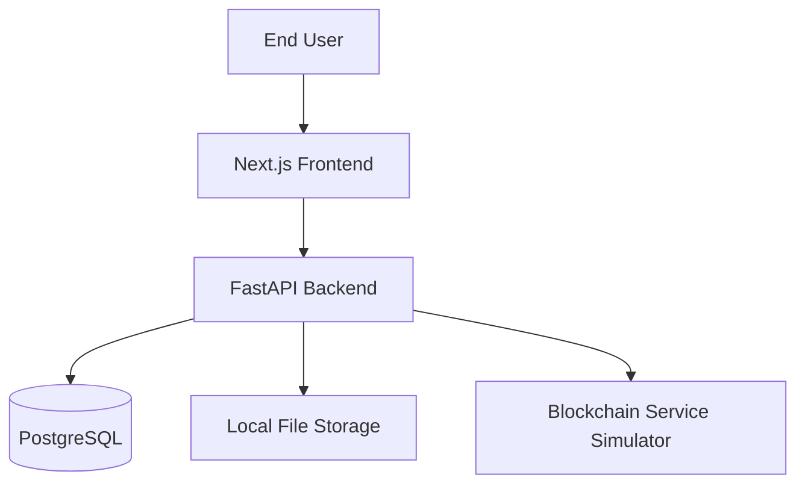

# NyayaVault System Architecture

## System Architecture

NyayaVault follows a modern decoupled three-tier architecture:
1. **Presentation Layer:** Next.js Server-Side Rendered (SSR) & Client components.
2. **Application/Business Logic Layer:** FastAPI RESTful services.
3. **Data Layer:** Relational SQL database (PostgreSQL) and block-chained file storage metadata.

## Frontend Architecture
Built with **Next.js 14** using the App Router.
* **UI Components:** Utilizes `shadcn/ui` and `Tailwind CSS` for a robust, accessible, and highly consistent government/cybersecurity aesthetic.
* **State Management:** React Context for Authentication (`AuthContext`); TanStack Query (or standard fetch) for server state.
* **Service Layer:** Axios is configured to handle base URLs and automatic token injection in interceptors.

## Backend Architecture
Built with **FastAPI** to leverage async I/O and automatic OpenAPI validation.
* **Routers:** Modularly separated by domain (`auth`, `cases`, `documents`, `signatures`, `blockchain`, `audit`, `users`, `reports`, `security`).
* **Dependencies:** `get_current_user` injected into secure routes to enforce authentication.
* **Storage Abstraction:** File uploads are currently routed to a local `media/` folder, abstracted to easily plug into an S3 bucket in the future.

## Database Model
Managed via **SQLAlchemy** ORM with **Alembic** migrations.
* **User & Roles:** Strong identity tables linking users to departments and specific roles.
* **Case & Document:** Hierarchical association. A Case has many Documents, a Document has many Versions.
* **EvidenceChain:** Append-only log tracking exact chain-of-custody for every document.
* **BlockchainRecord:** Prototype table simulating a linked-list cryptographic ledger. Each row contains `previous_block_hash` and `current_block_hash`.

## Authentication & Authorization (RBAC)
* **Auth Flow:** Standard OAuth2 Password Bearer flow yielding an Access Token (30 min) and Refresh Token (7 days).
* **RBAC:** Routes actively check `current_user.role`. Example: Only `INVESTIGATING_OFFICER` or `ADMIN` can create cases. `VIEWER` or `AUDITOR` are restricted to read-only paths.

## Hashing & Integrity
When a file is uploaded:
1. Streamed chunk by chunk to prevent memory exhaustion.
2. SHA-256 hash is computed.
3. Hash is saved in the Database.
4. Hash is anchored in the Blockchain simulator.
* **Verification:** The `/verify` endpoint recalculates the hash of the file currently on disk and compares it to the DB and Blockchain.

## Blockchain Architecture (Simulated)
To meet the Blockchain requirement without deploying a complex Hyperledger network for a local prototype:
* A `BlockchainRecord` table mimics blocks.
* Each "block" combines its data (including the `document_hash`) and the `previous_block_hash` to generate its own `current_block_hash`.
* Modifying any historical block breaks the cryptographic chain.

## Digital Signature Architecture
* **Prototype:** Uses an HMAC-SHA256 signature generated server-side using a secret key, the document hash, and the signer's identity.
* **Future Upgrade Path:** Connect to a real PKI/eSign provider where the client signs the hash using a hardware token or Aadhar eSign, and sends the signature back to the server for verification.

## Deployment Architecture
* Containerized using **Docker Compose**.
* Exposes standard ports: Frontend (3000), Backend (8000), Postgres (5432).
* Environment variables handle all sensitive keys and configurations (`.env`).
