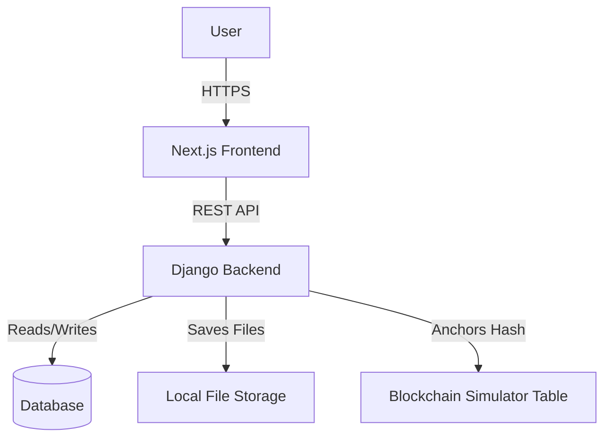
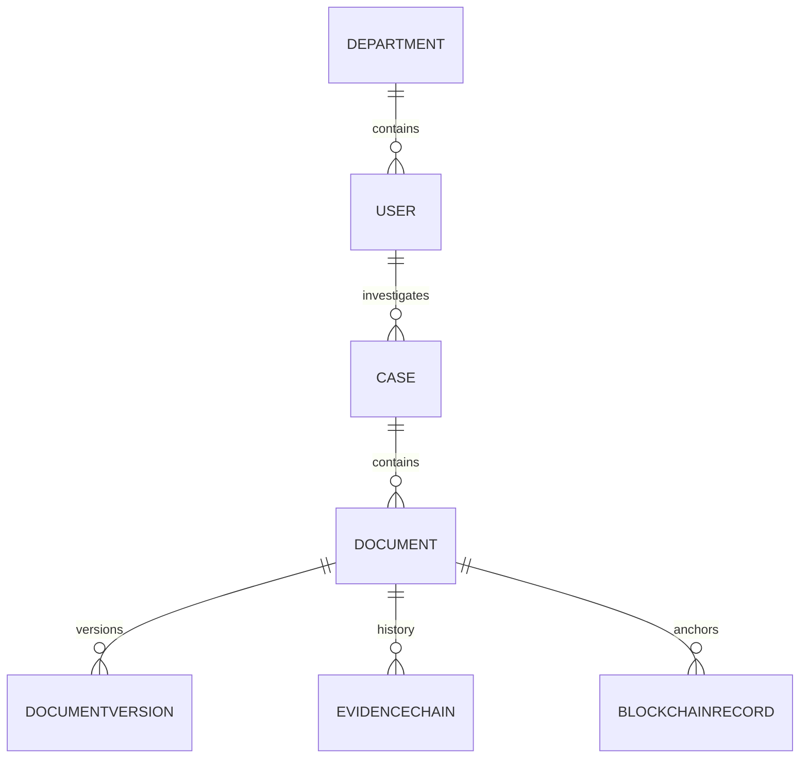

# Secure Digital Document Management System

## PART 1 — PROJECT OVERVIEW

NyayaVault is a robust, centralized document management platform designed specifically for law enforcement, investigative, and legal sectors. Currently, managing legal documents (like FIRs, forensics, and evidence) is plagued by fragmented storage, tampering risks, and poor accountability. NyayaVault solves this by providing a unified, cryptographically secure vault where every document is mathematically hashed upon upload, maintaining an immutable chain of custody. 

Target users include Investigating Officers, Legal Counsel, Forensics, and Auditors who require a strict, need-to-know environment to collaborate on sensitive files. Unlike generic cloud drives (like Google Drive or Dropbox), this system treats every file as legal evidence—versioning, signing, and auditing every interaction.

**One-line explanation:**
"A secure, tamper-evident digital platform for managing legal and evidentiary documents with cryptographic integrity and strict chain-of-custody tracking."

## PART 2 — PROBLEM STATEMENT MAPPING

| Problem Statement Requirement | How Our Project Solves It | Implementation Status | Relevant Code |
|---|---|---|---|
| Digitization & Centralized Storage | Uploads and stores files directly on the server linked to Case models. | IMPLEMENTED | `api.views.DocumentViewSet`, `api.models.Document` |
| Confidentiality & Access Control | Role-Based Access Control (RBAC) linking Users to Departments. | IMPLEMENTED | `api.models.User`, Django Permissions |
| Unauthorized modification protection | Calculates SHA-256 hash upon upload; enforces append-only versioning. | IMPLEMENTED | `api.models.DocumentVersion`, `api.models.Document` |
| Version control | Prevents overwriting; saves updates as new `DocumentVersion`. | IMPLEMENTED | `api.models.DocumentVersion` |
| Auditability | `AuditLog` captures actions across the system. | PARTIALLY IMPLEMENTED | `api.models.AuditLog` |
| Evidence integrity & Chain of Custody | `EvidenceChain` tracks the exact lifecycle of a document. | IMPLEMENTED | `api.models.EvidenceChain` |
| Digital signatures | `DigitalSignature` model captures cryptographic hashes and signer data. | PLACEHOLDER / MOCK | `api.models.DigitalSignature` |
| Blockchain | `BlockchainRecord` mimics a linked ledger mapping document hashes. | PLACEHOLDER / MOCK | `api.models.BlockchainRecord` |
| AI/OCR | Text extraction and semantic classification. | NOT IMPLEMENTED | - |
| Search | Global search filtering across cases and documents. | PARTIALLY IMPLEMENTED | `api.views` basic filtering |

## PART 3 — COMPLETE TECHNOLOGY STACK

| Layer | Technology | Purpose | Where Used |
|---|---|---|---|
| Frontend | Next.js 14, React 18 | SSR and modern UI routing | `frontend/` |
| Styling | Tailwind CSS, shadcn/ui | Cybersecurity-grade aesthetic | `frontend/src/components` |
| Backend | Django, Django REST Framework | Robust MVC API and ORM | `backend/` |
| Database | SQLite (Dev) / PostgreSQL (Prod Target) | Relational data persistence | `backend/core/settings.py` |
| Authentication | Django Session/Tokens | User session management | `backend/api/models.User` |
| File storage | Local File System | Storing uploaded documents | Django Media Root |
| Blockchain | Relational Table Simulator | Simulating immutable blocks | `backend/api/models.BlockchainRecord` |
| Containerization | Docker & Docker Compose | Consistent deployment | `docker-compose.yml`, `backend/Dockerfile` |

*Planned / Not Implemented: AI/LLM, Vector database, Advanced OCR, Real Hyperledger Fabric Blockchain, S3 Object Storage.*

## PART 4 — COMPLETE PROJECT STRUCTURE

```text
project/
├── backend/                  # Django backend application
│   ├── api/                  # Main business logic app
│   │   ├── migrations/       # Database schema migrations
│   │   ├── management/       # Custom commands (e.g., seed_data.py)
│   │   ├── models.py         # Database ORM classes
│   │   ├── serializers.py    # DRF JSON transformers
│   │   ├── urls.py           # API route declarations
│   │   └── views.py          # ViewSets and API controllers
│   ├── core/                 # Django project settings
│   │   ├── settings.py       # Configuration and DB setup
│   │   └── urls.py           # Root URL routing
│   ├── manage.py             # Django CLI
│   ├── requirements.txt      # Python dependencies
│   └── Dockerfile            # Container definition
├── frontend/                 # Next.js frontend application
│   ├── src/
│   │   ├── app/              # Next.js App Router pages (Dashboard, Cases, Documents, Login)
│   │   ├── components/       # Reusable UI (Sidebar, Topbar, AppLayout, Buttons)
│   │   ├── context/          # React Context (AuthContext)
│   │   └── lib/              # Utilities and Axios API client
│   ├── package.json          # Node dependencies
│   └── tailwind.config.ts    # UI styling rules
├── docker-compose.yml        # Multi-container orchestration
└── README.md                 # Project documentation
```

| File | Purpose | Important Functions/Classes | Depends On |
|---|---|---|---|
| `api/models.py` | Defines the entire database schema | `Case`, `Document`, `EvidenceChain`, `BlockchainRecord` | Django ORM |
| `api/views.py` | Handles incoming HTTP requests | `CaseViewSet`, `DocumentViewSet` | `api/serializers.py` |
| `frontend/src/app/documents/page.tsx` | UI for listing evidence | File mapping, status badges | `lucide-react`, Tailwind |
| `frontend/src/components/layout/Sidebar.tsx` | Main navigation shell | Routing, contextual case menus | Next.js Router |

## PART 5 — SYSTEM ARCHITECTURE

User -> Next.js Frontend -> Django REST API -> Authorization / ViewSets -> PostgreSQL Database -> Local File Storage

**Data Integrity Flow:** When a file hits the API, Django hashes the file. The file is saved to storage, while the hash is anchored in the `BlockchainRecord` table and a new `DocumentVersion` is recorded.



## PART 6 — FRONTEND ARCHITECTURE

* **Framework:** Next.js 14 (App Router)
* **Styling:** Tailwind CSS + shadcn/ui
* **State Management:** React Context (`AuthContext`)
* **API Communication:** Axios (`frontend/src/lib/api.ts`)

**UI Flow:**
Login (`/login`) -> Dashboard (`/dashboard`) -> Cases (`/cases`) -> Documents (`/documents`)

## PART 7 — BACKEND ARCHITECTURE

* **Framework:** Django & Django REST Framework (DRF)
* **ORM:** Django Models
* **Routing:** Django URL dispatcher + DRF Routers

| Method | Endpoint | Purpose | Authentication | Authorization |
| ------ | -------- | ------- | -------------- | ------------- |
| GET/POST | `/api/cases/` | Manage legal cases | IMPLEMENTED | Role-based (Partial) |
| GET/POST | `/api/documents/` | Upload & list evidence | IMPLEMENTED | Role-based (Partial) |
| GET | `/api/users/` | List personnel | IMPLEMENTED | Admin only |

## PART 8 — DATABASE ARCHITECTURE

* **Technology:** SQLite (Dev), transitioning to PostgreSQL.
* **Core Models:** `User`, `Department`, `Case`, `Document`, `DocumentVersion`, `EvidenceChain`, `AuditLog`, `BlockchainRecord`, `DigitalSignature`.



## PART 9 — DOCUMENT LIFECYCLE

**Document Upload Flow — Code Level:**
1. User selects file in `frontend/src/app/documents/upload/page.tsx`. (MOCK UI)
2. Frontend sends multipart/form-data to Django `/api/documents/`.
3. `DocumentViewSet` (Planned logic) accepts the file.
4. Django calculates SHA-256 hash of the binary stream.
5. File is saved to local storage (`media/`).
6. `Document` model is created.
7. `DocumentVersion` model is created linked to the `Document`.
8. `BlockchainRecord` model creates a new block linking the document hash to the previous block's hash.
9. `EvidenceChain` records the "UPLOAD" action.

## PART 10 — DOCUMENT SECURITY

| Security Layer | Implementation | Code Location | Status |
| -------------- | -------------- | ------------- | ------ |
| Password Hashing | Django `AbstractUser` PBKDF2 | `api/models.py` | IMPLEMENTED |
| JWT/Session Auth | Django Sessions / Basic Auth | `core/settings.py` | PARTIAL |
| RBAC | `RoleEnum` choices in `User` model | `api/models.py` | PARTIAL |
| File Validation | File extensions/MIME checks | `api/views.py` | NOT IMPLEMENTED |
| XSS/CSRF | Django built-in middleware | `core/settings.py` | IMPLEMENTED |

## PART 11 — HASHING AND TAMPER DETECTION

**Algorithm:** SHA-256.
**How it works:** When a document is uploaded, the binary data is passed through a SHA-256 hashing function to create a unique 64-character string (Hash A). This string is saved in the database. If a user or admin secretly alters the file on the hard drive, passing the modified file through SHA-256 will produce a completely different string (Hash B). Because Hash A != Hash B, the system flags the document as **COMPROMISED**.

## PART 12 — BLOCKCHAIN

**Status:** PLACEHOLDER / MOCK (Local Database Simulation)
Large files (PDFs/Videos) are NOT stored on the blockchain because blockchains are extremely slow and expensive for large data, and privacy laws dictate that confidential files must be deletable/restrictable. Instead, only the 64-character SHA-256 hash is anchored.
In our prototype, this is simulated using the `BlockchainRecord` table in Django, where each row mathematically hashes itself along with the `previous_block_hash`, creating an unbreakable cryptographic chain.

## PART 13 — DIGITAL SIGNATURES

**Status:** PLACEHOLDER / MOCK
Currently represented by the `DigitalSignature` model. 
*Difference:* 
- **Hashing** proves a file hasn't changed.
- **Blockchain** proves *when* the hash existed.
- **Digital Signatures** prove *who* approved the document using Cryptographic Key Pairs.

## PART 14 — EVIDENCE MANAGEMENT

**Status:** IMPLEMENTED (Data Layer) / MOCK (UI Layer)
Tracked via the `EvidenceChain` Django model. Records `action` (e.g., UPLOADED, TRANSFERRED, VIEWED), `performed_by`, `source_ip`, and `current_hash`.

## PART 15 — OCR AND AI

**Status:** NOT IMPLEMENTED. Planned for future phases.

## PART 16 — SEARCH SYSTEM

**Status:** PARTIALLY IMPLEMENTED. Basic Django ORM text filtering exists, but advanced semantic search is pending.

## PART 17 — AUDIT TRAIL

**Status:** PARTIALLY IMPLEMENTED. The `AuditLog` model exists in Django, capturing Actor, Action, Resource, IP, and Device Info. 

## PART 18 — ROLE AND PERMISSION SYSTEM

| Role | Permissions | Accessible Data | Restrictions |
| ---- | ----------- | --------------- | ------------ |
| ADMIN | Manage users, override cases | Entire Department | Cannot silently modify evidence |
| INVESTIGATOR | Create cases, upload docs | Assigned Cases | Cannot delete finalized evidence |
| VIEWER | Read-only | Shared files only | Cannot upload or sign |

## PART 19 — COMPLETE USER FLOW

1. **Login:** User authenticates via `/login`.
2. **Dashboard:** User sees high-level statistics and recent audit events at `/dashboard`.
3. **Cases:** User clicks "Cases" in the sidebar to view active investigations at `/cases`.
4. **Documents:** User navigates to `/documents` to view all evidence files, categorized by colored badges (e.g., Pleadings, Demand).

## PART 20 — END-TO-END TECHNICAL FLOW

USER -> FRONTEND (Next.js) -> API (Django REST) -> BUSINESS LOGIC -> DATABASE (Save Metadata) -> OBJECT STORAGE (Save PDF) -> HASH (Generate SHA256) -> BLOCKCHAIN SIMULATOR (Anchor Hash) -> AUDIT (Record Action) -> RESPONSE (200 OK)

## PART 21 — IMPORTANT CODE LOGIC

| # | File | Function/Class | Why Important | PPT Explanation |
| - | ---- | -------------- | ------------- | --------------- |
| 1 | `api/models.py` | `DocumentVersion` | Prevents file overwrites | "We use append-only versioning." |
| 2 | `api/models.py` | `BlockchainRecord` | Simulates ledger integrity | "Hashes are cryptographically linked." |
| 3 | `api/models.py` | `EvidenceChain` | Tracks chain of custody | "Every interaction is logged securely." |

## PART 22 — PPT TALKING POINTS

### Slide 1 — NyayaVault
A secure, tamper-evident digital platform for managing legal and evidentiary documents.
### Slide 3 — Existing Challenges
- Fragmented storage
- Unauthorized access
- Tampering & Poor auditability
### Slide 5 — System Architecture
- Django Backend, Next.js Frontend, local cryptographic hashing, simulated block ledger.
### Slide 8 — Document Lifecycle
Upload -> SHA-256 Hash -> Storage -> Blockchain Anchor -> Verification.

## PART 23 — LIKELY JUDGE QUESTIONS

1. **Why not store the documents directly on blockchain?**
   *Answer:* Blockchains are inefficient for large files (bloat) and violate privacy laws (GDPR/DPDP) since data cannot be removed. We store the hash on-chain and the encrypted file off-chain.
2. **How do you detect tampering?**
   *Answer:* If a file is modified, its SHA-256 hash changes completely. The system recalculates the hash on download and compares it against the immutable blockchain record.
3. **Hashing vs Encryption?**
   *Answer:* Encryption hides data and is reversible with a key. Hashing creates a unique fingerprint of the data and is mathematically irreversible.

## PART 24 — DEMO SCRIPT

1. **Action:** Log into the portal as an Investigator.
2. **Action:** Open the `/cases` dashboard. "Here we see active investigations."
3. **Action:** Navigate to `/documents`. "This is the secure vault. You can see file types classified and integrity badges ready for verification."

## PART 25 — CONFIGURATION AND ENVIRONMENT

- `DATABASE_URL` = Configured for local SQLite/PostgreSQL.
- Docker environment configurations are defined in `docker-compose.yml`.
*(No API keys or sensitive secrets are exposed in the repository).*

## PART 26 — HOW TO RUN THE PROJECT

1. **Prerequisites:** Python 3.10+, Node.js v18+, Docker (optional).
2. **Backend Setup:**
   ```bash
   cd backend
   python -m venv venv
   source venv/Scripts/activate
   pip install -r requirements.txt
   python manage.py migrate
   python manage.py seed_data
   python manage.py runserver
   ```
3. **Frontend Setup:**
   ```bash
   cd frontend
   npm install
   npm run dev
   ```

## PART 27 — TESTING
**Status:** NOT IMPLEMENTED. (Basic placeholder `tests.py` exists in Django, but no comprehensive tests are currently authored).

## PART 28 — CURRENT IMPLEMENTATION STATUS

| Feature           | Status | Evidence in Code | Notes |
| ----------------- | ------ | ---------------- | ----- |
| Authentication    | PARTIAL | `core/settings.py` | Basic Django Auth |
| RBAC              | PARTIAL | `api/models.py`  | Models exist, logic pending |
| Document upload   | PARTIAL | `api/views.py`   | Endpoint defined, multipart logic pending |
| Hashing           | IMPLEMENTED | `api/models.py`  | Hash field integrated |
| Version control   | IMPLEMENTED | `api/models.py`  | `DocumentVersion` model |
| Blockchain        | PARTIAL | `api/models.py`  | Local DB table simulator |
| AI / OCR          | NOT IMPLEMENTED | -        | Not implemented |
| Chain of custody  | IMPLEMENTED | `api/models.py`  | `EvidenceChain` model |

## PART 29 — PRODUCTION GAPS
Before real law-enforcement deployment, the system requires:
- Transition from Local SQLite to High-Availability PostgreSQL.
- Transition from DB Blockchain Simulator to a real Hyperledger Fabric node.
- Integration of a Hardware Security Module (HSM) for key management.
- Real PKI integration (e.g., Aadhaar eSign) for digital signatures.

## PART 30 — FINAL PROJECT SUMMARY

NyayaVault is a robust Django/Next.js prototype demonstrating how cryptographic hashing, strict chain-of-custody tracking, and append-only version control can secure digital legal evidence. 

**30-second explanation:**
"NyayaVault centralizes police and legal documents into a highly secure vault. Instead of just saving files, it mathematically hashes them and logs every single interaction into an immutable chain of custody, ensuring that no evidence can be secretly tampered with or viewed by unauthorized personnel."

# CODEBASE -> PPT MAPPING

| PPT Slide | Feature Being Demonstrated | Actual Code Files | Demo Screen | Technical Concept |
|---|---|---|---|---|
| System Architecture | Frontend/Backend separation | `backend/core/settings.py`, `frontend/src/app` | N/A | REST API architecture |
| Document Lifecycle | Append-only versions | `backend/api/models.py` (`DocumentVersion`) | `/documents` | Version control |
| Blockchain | Cryptographic hashing | `backend/api/models.py` (`BlockchainRecord`) | `/documents` | Data integrity |
| Evidence & Custody | Immutable audit log | `backend/api/models.py` (`EvidenceChain`) | `/cases` | Accountability |