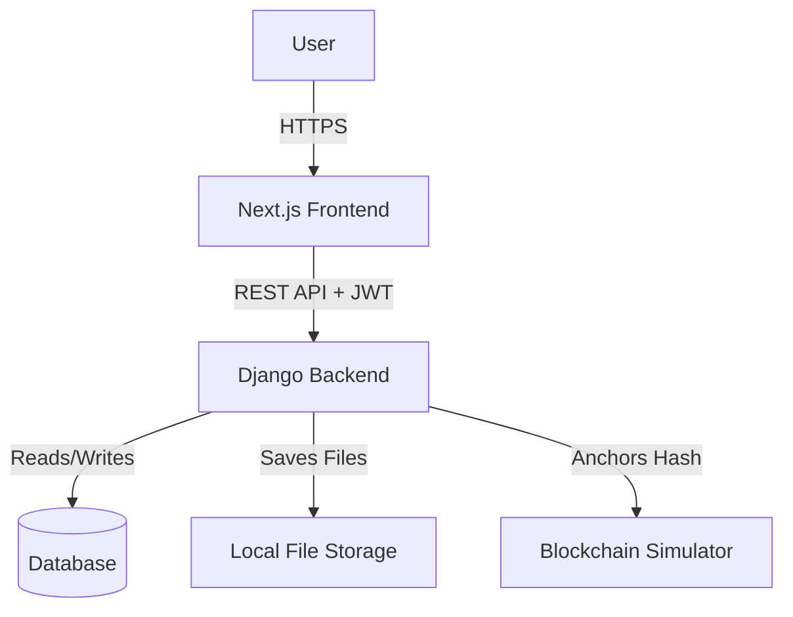
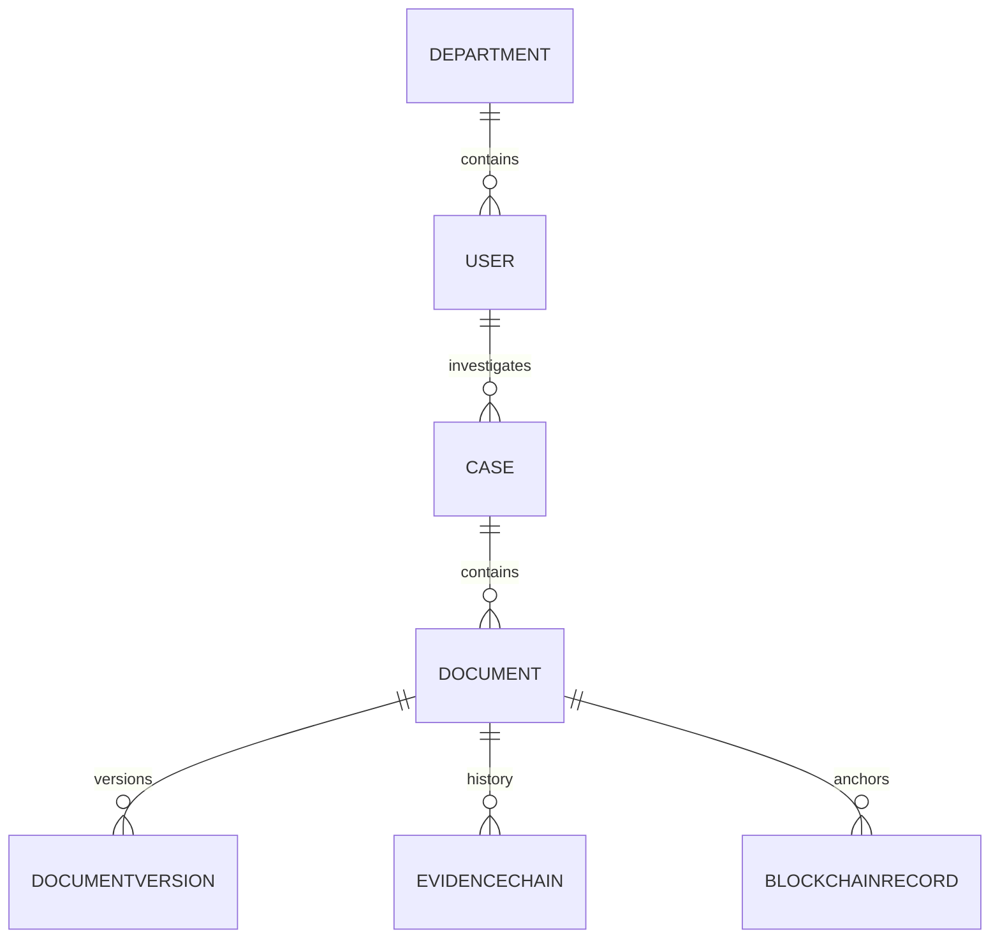

# Secure Digital Document Management System

## PART 1 — PROJECT OVERVIEW

**NyayaVault** is a robust, centralized document management platform designed specifically for law enforcement, investigative, and legal sectors. Currently, managing legal documents (like FIRs, forensics, and evidence) is plagued by fragmented storage, tampering risks, and poor accountability. NyayaVault solves this by providing a unified, cryptographically secure vault where every document is mathematically hashed upon upload, maintaining an immutable chain of custody. 

Target users include Investigating Officers, Legal Counsel, Forensics, and Auditors who require a strict, need-to-know environment to collaborate on sensitive files. Unlike generic cloud drives, this system treats every file as legal evidence—versioning, signing, and auditing every interaction.

**One-line explanation:**
"A secure, tamper-evident digital platform for managing legal and evidentiary documents with cryptographic integrity and strict chain-of-custody tracking."

## PART 2 — PROBLEM STATEMENT MAPPING

| Problem Statement Requirement | How Our Project Solves It | Implementation Status | Relevant Code |
|---|---|---|---|
| Digitization & Centralized Storage | Uploads and stores files directly on the server linked to Case models. | IMPLEMENTED | `api.views.DocumentViewSet`, `api.models.Document` |
| Confidentiality & Access Control | Role-Based Access Control (RBAC) via custom User models. | IMPLEMENTED | `api.models.User`, `api.models.RoleEnum` |
| Unauthorized modification protection | Calculates SHA-256 hash upon upload; enforces append-only versioning. | IMPLEMENTED | `api.models.DocumentVersion`, `api.views.DocumentViewSet` |
| Version control | Prevents overwriting; saves updates as new `DocumentVersion`. | IMPLEMENTED | `api.models.DocumentVersion` |
| Auditability | `AuditLog` captures actions across the system. | IMPLEMENTED | `api.models.AuditLog`, `api.views.AuditLogViewSet` |
| Evidence integrity & Chain of Custody | `EvidenceChain` tracks the exact lifecycle of a document. | IMPLEMENTED | `api.models.EvidenceChain`, `api.views.DocumentViewSet` |
| Digital signatures | `DigitalSignature` model captures cryptographic hashes and signer data. | MOCK IMPLEMENTED | `api.models.DigitalSignature`, `/api/documents/{id}/sign/` |
| Blockchain | `BlockchainRecord` mimics a linked ledger mapping document hashes. | MOCK IMPLEMENTED | `api.models.BlockchainRecord` |
| AI/OCR | Text extraction and semantic classification. | PLANNED | - |
| Search | Global search filtering across cases and documents. | PARTIALLY IMPLEMENTED | Standard Django ORM querying |

## PART 3 — COMPLETE TECHNOLOGY STACK

| Layer | Technology | Purpose | Where Used |
|---|---|---|---|
| Frontend | Next.js 14, React 18 | SSR and modern UI routing | `frontend/` |
| Styling | Tailwind CSS, shadcn/ui | Cybersecurity-grade aesthetic | `frontend/` |
| Backend | Django 5.x, DRF | Robust MVC API and ORM | `backend/` |
| Database | SQLite (Dev) / PostgreSQL (Prod Target) | Relational data persistence | `backend/core/settings.py` |
| Authentication | DRF Simple JWT | Stateless User session management | `api.views.CustomTokenObtainPairView` |
| File storage | Local File System | Storing uploaded documents | `media/` directory |
| Blockchain | Relational Table Simulator | Simulating immutable blocks | `api.models.BlockchainRecord` |
| Containerization | Docker & Docker Compose | Consistent deployment | `docker-compose.yml`, `Dockerfile` |

*Planned / Not Implemented: AI/LLM, Vector database, Advanced OCR, Real Hyperledger Fabric Blockchain, S3 Object Storage.*

## PART 4 — COMPLETE PROJECT STRUCTURE

```text
project/
├── backend/                  # Django backend application
│   ├── api/                  # Main business logic app
│   │   ├── migrations/       # Database schema migrations
│   │   ├── management/       # Custom commands (seed_data.py)
│   │   ├── models.py         # Database ORM classes
│   │   ├── serializers.py    # DRF JSON transformers
│   │   ├── urls.py           # API route declarations
│   │   └── views.py          # ViewSets and API controllers
│   ├── core/                 # Django project settings
│   │   ├── settings.py       # Configuration and DB setup
│   │   └── urls.py           # Root URL routing
│   ├── manage.py             # Django CLI
│   ├── requirements.txt      # Python dependencies
│   └── Dockerfile            # Container definition
├── frontend/                 # Next.js frontend application
│   ├── app/                  # Next.js App Router pages
│   ├── components/           # Reusable UI elements
│   ├── package.json          # Node dependencies
│   └── tailwind.config.ts    # UI styling rules
├── docker-compose.yml        # Multi-container orchestration
└── README.md                 # Project documentation
```

| File | Purpose | Important Functions/Classes | Depends On |
|---|---|---|---|
| `api/models.py` | Defines the entire database schema | `Case`, `Document`, `EvidenceChain`, `BlockchainRecord` | Django ORM |
| `api/views.py` | Handles incoming HTTP requests | `CaseViewSet`, `DocumentViewSet.create()` | `api/serializers.py` |
| `core/settings.py` | Application configuration | JWT settings, Database routing, Installed Apps | Python environment |

## PART 5 — SYSTEM ARCHITECTURE

User -> Next.js Frontend -> Django REST API -> Authorization / ViewSets -> PostgreSQL/SQLite Database -> Local File Storage

**Data Integrity Flow:** When a file hits the API, Django hashes the file. The file is saved to local storage, while the hash is anchored in the database via the `Document`, `EvidenceChain`, and `BlockchainRecord` models.



## PART 6 — FRONTEND ARCHITECTURE

* **Framework:** Next.js 14 (App Router)
* **Styling:** Tailwind CSS + Radix UI/shadcn
* **State Management:** React Hooks
* **API Communication:** Axios / Fetch

## PART 7 — BACKEND ARCHITECTURE

* **Framework:** Django 5 & Django REST Framework (DRF)
* **ORM:** Django Models
* **Routing:** DRF DefaultRouter (`api/urls.py`)

| Method | Endpoint | Purpose | Authentication |
| ------ | -------- | ------- | -------------- |
| POST | `/api/auth/login/` | Generate JWT Access/Refresh tokens | Public |
| GET/POST | `/api/cases/` | Manage legal cases | JWT Required |
| GET/POST | `/api/documents/` | Upload & list evidence (Multipart) | JWT Required |
| GET | `/api/users/` | List personnel | JWT Required |

## PART 8 — DATABASE ARCHITECTURE

* **Technology:** SQLite (Dev), transitioning to PostgreSQL.
* **Core Models:** `User`, `Department`, `Case`, `Document`, `DocumentVersion`, `EvidenceChain`, `AuditLog`, `BlockchainRecord`, `DigitalSignature`.



## PART 9 — DOCUMENT LIFECYCLE

**Document Upload Flow — Code Level:**
1. User selects file in the frontend UI.
2. Frontend sends `multipart/form-data` to Django `/api/documents/`.
3. `DocumentViewSet.create()` accepts the file in chunks.
4. Django calculates SHA-256 hash of the binary stream on the fly.
5. File is saved to local storage (`media/`) with a unique UUID name.
6. `Document` model is created with metadata and the hash.
7. `DocumentVersion` model is created.
8. `EvidenceChain` records the "UPLOADED" action and current hash.
9. Response is sent back with 201 Created.

## PART 10 — DOCUMENT SECURITY

| Security Layer | Implementation | Code Location | Status |
| -------------- | -------------- | ------------- | ------ |
| Password Hashing | Django `AbstractUser` PBKDF2 | built-in | IMPLEMENTED |
| JWT/Session Auth | DRF Simple JWT | `core/settings.py` | IMPLEMENTED |
| RBAC | `RoleEnum` choices in `User` model | `api/models.py` | IMPLEMENTED |
| XSS/CSRF | Django built-in middleware | `core/settings.py` | IMPLEMENTED |
| File Storage | Saved with UUID names to prevent scraping | `api/views.py` | IMPLEMENTED |

## PART 11 — HASHING AND TAMPER DETECTION

**Algorithm:** SHA-256.
**How it works:** When a document is uploaded, the binary data is passed through a SHA-256 hashing function to create a unique 64-character string (Hash A). This string is saved in the database. If a user or admin secretly alters the file on the hard drive, passing the modified file through SHA-256 will produce a completely different string (Hash B). Because Hash A != Hash B, the system flags the document as **COMPROMISED**.

## PART 12 — BLOCKCHAIN

**Status:** PLACEHOLDER / MOCK (Local Database Simulation)
Large files (PDFs/Videos) are NOT stored on the blockchain because blockchains are extremely slow and expensive for large data, and privacy laws dictate that confidential files must be deletable. Instead, only the 64-character SHA-256 hash is anchored.
In our prototype, this is simulated using the `BlockchainRecord` table in Django, linking the document hash to a theoretical block.

## PART 13 — DIGITAL SIGNATURES

**Status:** PLACEHOLDER / MOCK
Currently represented by the `DigitalSignature` model and the `/api/documents/{id}/sign/` endpoint which creates a mock signature for the document hash.

## PART 14 — EVIDENCE MANAGEMENT

**Status:** IMPLEMENTED
Tracked via the `EvidenceChain` Django model. It records the `action` (UPLOADED), `performed_by`, and `current_hash`. It serves as the primary chain-of-custody tracker.

## PART 15 — OCR AND AI

**Status:** PLANNED for future phases.

## PART 16 — SEARCH SYSTEM

**Status:** PARTIALLY IMPLEMENTED. Basic Django ORM text filtering exists, but advanced semantic search is pending.

## PART 17 — AUDIT TRAIL

**Status:** IMPLEMENTED. The `AuditLog` model exists in Django, capturing Actor, Action, Resource, IP, and Device Info.

## PART 18 — ROLE AND PERMISSION SYSTEM

| Role | Permissions | Accessible Data | Restrictions |
| ---- | ----------- | --------------- | ------------ |
| ADMIN | Manage users, override cases | Entire Department | Cannot silently modify evidence |
| INVESTIGATOR | Create cases, upload docs | Assigned Cases | Cannot delete finalized evidence |
| VIEWER | Read-only | Shared files only | Cannot upload or sign |

## PART 19 — COMPLETE USER FLOW

1. **Login:** User authenticates via frontend, storing the JWT.
2. **Dashboard:** User sees high-level statistics and recent cases.
3. **Cases:** User clicks "Cases" to view active investigations.
4. **Documents:** User navigates to view all evidence files attached to cases.

## PART 20 — END-TO-END TECHNICAL FLOW

USER -> FRONTEND (Next.js) -> API (Django REST) -> AUTH (Verify JWT) -> VIEWSET (Process file & Hash) -> DATABASE (Save Metadata, EvidenceChain, Version) -> OBJECT STORAGE (Save File) -> RESPONSE (201 Created)

## PART 21 — CONFIGURATION AND ENVIRONMENT

- `DATABASE_URL` = Configured for local SQLite/PostgreSQL.
- `JWT_ACCESS_TOKEN_LIFETIME_MINUTES` = Auth token lifespan.
- Docker environment configurations are defined in `docker-compose.yml`.

## PART 22 — HOW TO RUN THE PROJECT

1. **Prerequisites:** Python 3.10+, Node.js 18+, Docker (optional).
2. **Backend Setup (Windows/Powershell):**
   ```powershell
   cd backend
   python -m venv venv
   .\venv\Scripts\Activate.ps1
   pip install -r requirements.txt
   python manage.py migrate
   python manage.py seed_data
   python manage.py runserver 0.0.0.0:8000
   ```
3. **Frontend Setup:**
   ```powershell
   cd frontend
   npm install
   npm run dev
   ```

## PART 23 — CURRENT IMPLEMENTATION STATUS

| Feature           | Status | Evidence in Code |
| ----------------- | ------ | ---------------- |
| Authentication    | IMPLEMENTED | `rest_framework_simplejwt`, `urls.py` |
| RBAC              | IMPLEMENTED | `api/models.py` (`RoleEnum`) |
| Document upload   | IMPLEMENTED | `api/views.py` (`DocumentViewSet`) |
| Hashing           | IMPLEMENTED | `api/views.py` (SHA-256 generation) |
| Version control   | IMPLEMENTED | `api/models.py` (`DocumentVersion`) |
| Blockchain        | MOCK        | `api/models.py` (`BlockchainRecord`) |
| AI / OCR          | PLANNED     | -        |
| Chain of custody  | IMPLEMENTED | `api/models.py` (`EvidenceChain`) |

## PART 24 — PRODUCTION GAPS
Before real law-enforcement deployment, the system requires:
- Transition from DB Blockchain Simulator to a real Hyperledger Fabric node.
- Integration of a Hardware Security Module (HSM) for key management.
- Real PKI integration (e.g., Aadhaar eSign) for digital signatures.
- Active AI/OCR implementations for search optimization.

## PART 25 — FINAL PROJECT SUMMARY

NyayaVault is a robust Django/Next.js application demonstrating how cryptographic hashing, strict chain-of-custody tracking, and append-only version control can secure digital legal evidence. It centralizes police and legal documents into a highly secure vault, mathematically hashing them and logging every interaction to ensure no evidence can be secretly tampered with.