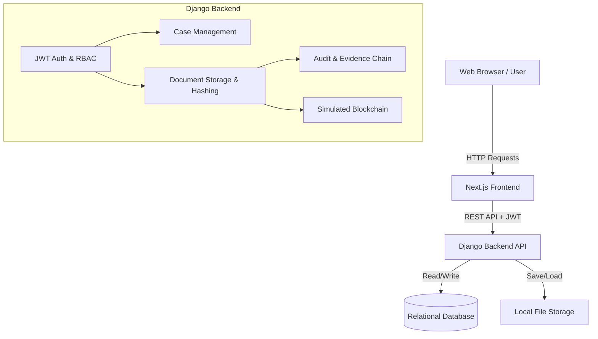

# 1. Architecture Overview

Secura follows a modern, decoupled three-tier architecture, utilizing a React-based frontend, a Django REST backend, and a relational database. 

```text
User 
 ↓ (HTTPS / JSON)
Frontend (Next.js 14)
 ↓ (REST API + JWT)
API (Django REST Framework)
 ↓ (Middleware)
Authentication (Simple JWT)
 ↓ (Permissions)
Authorization (DRF Permission Classes)
 ↓ (Views / Serializers)
Business Logic (Case & Document Management)
 ↓ (ORM)
Database (SQLite / PostgreSQL)
 ↓ (File System)
File Storage (Local /media/)
 ↓ (Hashing)
Integrity/Blockchain (Simulated in DB)
 ↓ (Signals / View Logic)
Audit (EvidenceChain & AuditLog)
```

# 2. Technology Stack

| Layer | Technology | Purpose |
|---|---|---|
| Frontend Framework | Next.js 14 (React 18) | UI rendering, client/server routing |
| Frontend Styling | Tailwind CSS, shadcn/ui | Component design and responsive layout |
| Backend Framework | Django 5.x | Core backend server, ORM, and admin |
| API Layer | Django REST Framework (DRF) | RESTful API endpoints and serialization |
| Authentication | djangorestframework-simplejwt | JWT-based auth (access/refresh tokens) |
| Database | SQLite (Dev) / PostgreSQL (Prod) | Relational data storage |
| File Storage | Local File System (`/media/`) | Storing uploaded documents |
| Containerization | Docker & Docker Compose | Consistent development and deployment |

# 3. System Architecture Diagram



# 4. Frontend Architecture

- **Framework:** Next.js 14 using the App Router.
- **Routing:** File-based routing (`/cases`, `/documents`, `/audit`, etc.).
- **Pages:** Server-rendered and client-rendered pages based on Next.js conventions.
- **Components:** Built with React, Tailwind CSS, and Radix UI (shadcn-like approach).
- **State management:** React Hooks and standard fetch/axios mechanisms.
- **API communication:** Axios configured with base URLs and interceptors.
- **Authentication flow:** JWT tokens stored securely, passed in `Authorization: Bearer` headers.

# 5. Backend Architecture

- **Server:** Django WSGI/ASGI running via `runserver` or `uvicorn`/`gunicorn` in prod.
- **API:** Django REST Framework `ViewSets` and `Routers`.
- **Routes:** Registered via `DefaultRouter` in `urls.py`.
- **Controllers:** DRF Views (`UserViewSet`, `CaseViewSet`, `DocumentViewSet`, etc.).
- **Services:** Heavy logic is handled within ViewSets (e.g., `DocumentViewSet.create` handles hashing, saving, versioning, and auditing).
- **Validation:** DRF Serializers.
- **Authentication:** `TokenObtainPairView` from `rest_framework_simplejwt`.
- **Authorization:** `permission_classes = [permissions.IsAuthenticated]` combined with role-based checks.

# 6. Database Architecture

- **Database:** SQLite (default) or PostgreSQL.
- **Models:** Defined in `backend/api/models.py`.
- **Important Tables:**
  - `User`: Extended Django `AbstractUser` with `role`, `department`.
  - `Case`: Tracks investigations.
  - `Document` & `DocumentVersion`: Stores file metadata and versions.
  - `EvidenceChain`: Immutable log of actions on a document.
  - `AuditLog`: System-wide audit trails.
  - `BlockchainRecord`: Simulated ledger records.

# 7. File Storage Architecture

- Documents are uploaded via multipart/form-data.
- Saved directly to the local filesystem in the `media/` directory.
- `file_path` is stored in the `Document` and `DocumentVersion` tables.

# 8. Authentication Architecture

- Uses OAuth2-style JSON Web Tokens (JWT).
- Login endpoint (`/auth/login/`) returns an `access` token and `refresh` token.
- Protected routes require the `access` token.
- Tokens are stateless; server validates cryptographically.

# 9. Authorization Architecture

- Role-Based Access Control (RBAC) via the `RoleEnum` (SUPER_ADMIN, ADMIN, INVESTIGATING_OFFICER, etc.).
- While basic `IsAuthenticated` is applied globally in views, granular permissions are implemented per business logic requirements.

# 10. Document Lifecycle

Upload
 ↓
Validation (DRF Serializers)
 ↓
Processing (Generate SHA-256 Hash chunk-by-chunk)
 ↓
Storage (Saved to `/media/` folder with UUID filename)
 ↓
Metadata (DB Record created in `Document`)
 ↓
Audit (Record created in `DocumentVersion` and `EvidenceChain`)

# 11. Evidence Lifecycle

- When a document is uploaded, an `EvidenceChain` record is immediately created with `action="UPLOADED"` and the `current_hash`.
- This table acts as a chronologic timeline for chain of custody.

# 12. Blockchain Architecture

- **Simulated:** A true distributed ledger is NOT implemented.
- **What is stored:** The document's SHA-256 hash, actor, timestamp, and a `transaction_id`.
- **Why it's used:** To demonstrate how blockchain anchoring works for evidence integrity, ensuring a hash is cryptographically bound to a timeline.

# 13. AI Architecture

- **PLANNED / NOT CURRENTLY IMPLEMENTED.**
- The system currently does not feature active OCR, embeddings, or LLM-based summarization.

# 14. Search Architecture

- **PARTIALLY IMPLEMENTED.**
- Search relies on standard database indexing (e.g., querying `case_number`, `title` via Django ORM). Semantic search is planned.

# 15. Audit Architecture

- Actions are logged in the `AuditLog` table (for system-wide events) and `EvidenceChain` table (specifically for document chain-of-custody).

# 16. Security Architecture

- **Implemented:**
  - Passwords hashed using Django's secure password hashers.
  - JWT for stateless, time-bound session management.
  - SHA-256 hashing of all uploaded files to detect tampering.
  - UUIDs used for filenames to prevent directory traversal and guessing.
  - CORS headers configured to restrict frontend access.

# 17. Complete Request Flow

User clicks "Upload"
 ↓
Frontend (Next.js) sends `multipart/form-data` to API
 ↓
API receives request at `/api/documents/`
 ↓
Authentication middleware verifies JWT
 ↓
Authorization checks if user has upload rights
 ↓
`DocumentViewSet.create()` processes file, hashes it, saves to disk
 ↓
Database updates `Document`, `DocumentVersion`, `EvidenceChain`
 ↓
Response returns 201 Created with Document JSON

# 18. Project Folder Structure

- `/backend/` - Django application root.
  - `/backend/api/` - Main DRF app containing models, views, urls, serializers.
  - `/backend/core/` - Django project settings and configuration.
  - `/backend/manage.py` - Django CLI.
  - `/backend/media/` - Local file storage for uploads.
- `/frontend/` - Next.js application root.
  - `/frontend/app/` - Next.js App Router pages and layouts.
  - `/frontend/components/` - Reusable React components.
  - `/frontend/package.json` - Node dependencies.
